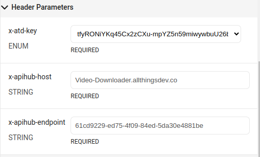

# Instagram Video Download Telegram Bot


Instagram videolarini yuklab olish uchun Telegram bot. Ushbu bot foydalanuvchilarga Instagram postlaridagi videolarni yuklab olishga imkon beradi.

## Xususiyatlar

- Instagram video postlarini yuklab olish
- Foydalanuvchilarga videolarni to'g'ridan-to'g'ri Telegram orqali yuborish
- Oddiy va foydalanishga oson interfeys

## Talablar

- Python 3.11 yoki undan yuqori versiya
- `aiogram` kutubxonasi

## Api Key olish

[AllThingsDev](https://www.allthingsdev.co/apimarketplace/video-downloader/6687d7f8a1b36a72f5403c48)

## O'rnatish

1. Ushbu repositoryni klonlang:

    ```bash
    git clone https://github.com/dostontv/instagramVideo.git
    cd instagramVideo
    ```

2. Kerakli kutubxonalarni o'rnating:

    ```bash
    pip install -r requirements.txt
    ```

3. Telegram Bot Tokenni oling va uni `.env` faylida ko'rsating:
    
    

    [AllThingsDev](https://www.allthingsdev.co/apimarketplace/video-downloader/6687d7f8a1b36a72f5403c48)
    saytidan oling
   ```
    BOT_TOKEN = 'SIZNING TELEGRAM BOT TOKENINGIZ'
    API_KEY = 'x-atd-key'
    API_HOST = 'x-apihub-host'
    API_ENDPOINT = 'x-apihub-endpoint'
    ```

4. Botni ishga tushiring:

    ```bash
    python main.py
    ```

## Foydalanish

1. Telegramda bot bilan chatni boshlang.
2. Instagram video postining URL manzilini yuboring.
3. Bot sizga videoni yuklab beradi va Telegram orqali yuboradi.
